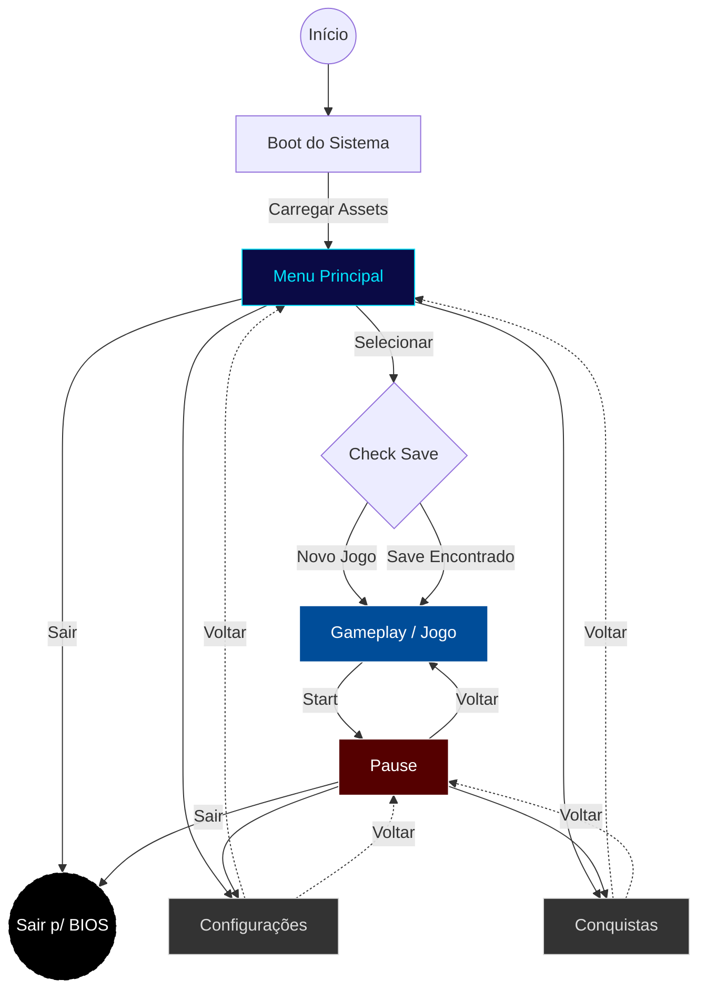
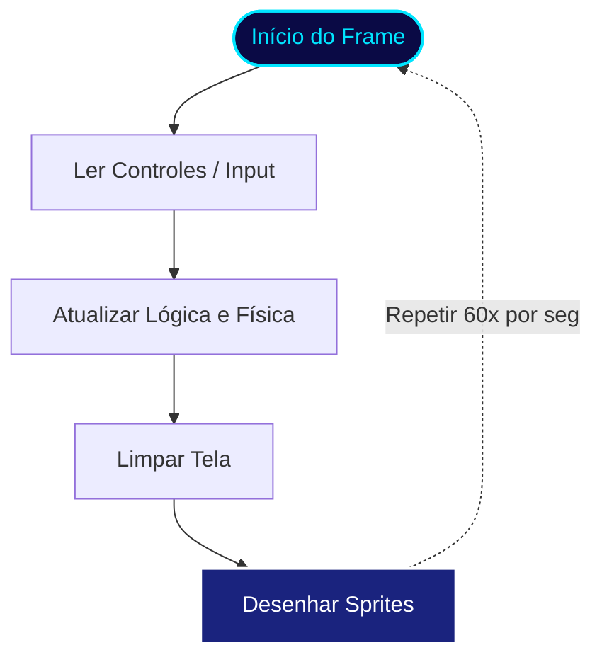
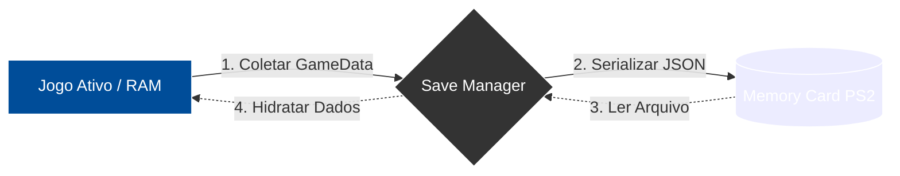

# 🧠 Arquitetura e Fluxo de Dados

Este documento descreve como os dados fluem dentro do jogo **Krone: Ruínas Ancestrais**, desde a inicialização até o loop de jogo.

## 1. Estrutura de Pastas
A organização do código segue o padrão de separação por responsabilidade:

* **`/states`**: Máquina de estados (Menu, Jogo, Pause).
* **`/systems`**: Gerenciadores globais (Input, Save, Config).
* **`/entities`**: Objetos do jogo (Player, Inimigos).
* **`/data`**: Dados estáticos (Conquistas, Paletas de cores).

```text
📦 Krone_Ruinas_Ancestrais
 ┣ 📂 data        # Dados estáticos (Conquistas, Paletas de cores)
 ┣ 📂 entities    # Objetos do jogo (Player, Inimigos)
 ┣ 📂 menus       # Scripts de Interface (UI de Save, Opções)
 ┣ 📂 states      # Máquina de estados (Menu, Jogo, Pause)
 ┣ 📂 systems     # Gerenciadores globais (Input, Save, Config)
 ┣ 📂 sprites     # Arquivos de imagem e texturas
 ┗ 📜 main.js     # Ponto de entrada (Boot)
```
📂 Navegador Interativo (Clique para expandir)

<details>
  <summary><b>📂 systems</b> (Núcleo Lógico)</summary>
  <blockquote>
    <ul>
      <li>📜 <code>config.js</code> - Configurações de Boot</li>
      <li>📜 <code>save.js</code> - Sistema de Memory Card</li>
      <li>📜 <code>input.js</code> - Mapeamento DualShock 2</li>
    </ul>
  </blockquote>
</details> 

<details>
  <summary><b>📂 states</b> (Cenas)</summary>
  <blockquote>
    <ul>
      <li>📜 <code>state_menu.js</code> - Tela Principal</li>
      <li>📜 <code>state_game.js</code> - Gameplay Loop</li>
    </ul>
  </blockquote>
</details> 

<details>
  <summary><b>📂 entities</b> (Objetos)</summary>
  <blockquote>
    <ul>
      <li>📜 <code>player.js</code> - Lógica do Herói</li>
      <li>📜 <code>enemies.js</code> - IA Básica</li>
    </ul>
  </blockquote>
</details>

---

## 2. Diagrama de Estados (FSM)
Este diagrama mostra como o jogo navega entre as diferentes telas (`states`):



---

## 3. Diagrama de Sequência (Game Loop)
Este diagrama detalha o que acontece no `main.js` a cada frame (60 vezes por segundo):


---

## 4. Fluxo de Persistência (Save System)
Este diagrama ilustra como os dados do jogador saem da memória RAM e são gravados fisicamente no Memory Card (mc0:) do PlayStation 2.


