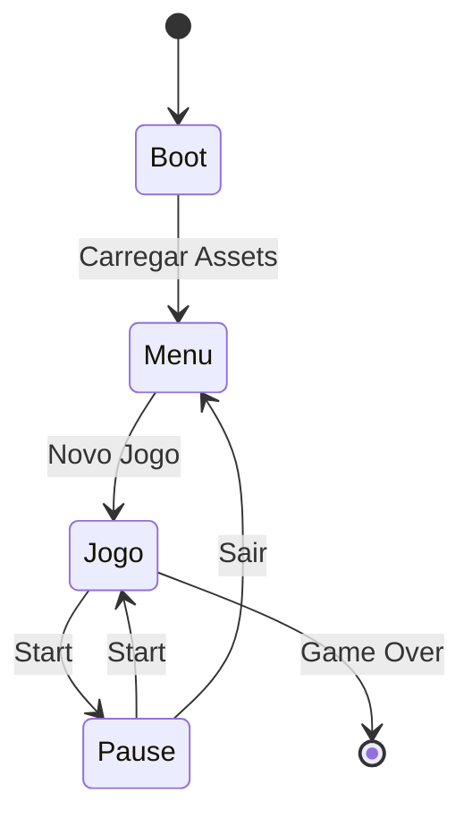
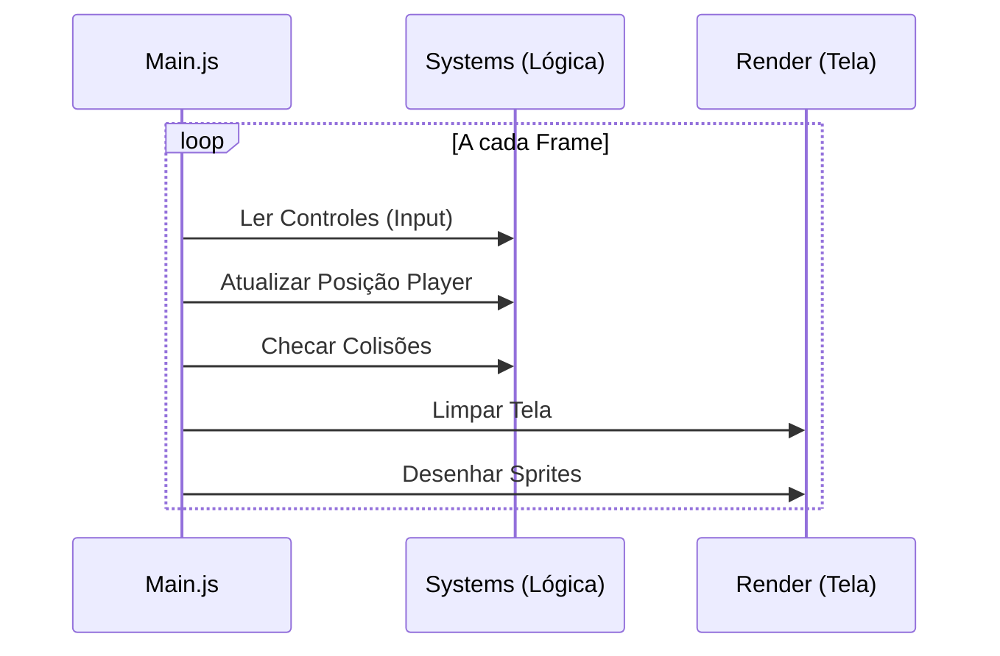

# 🧠 Arquitetura e Fluxo de Dados

Este documento descreve como os dados fluem dentro do jogo **Krone: Ruínas Ancestrais**, desde a inicialização até o loop de jogo.

## 1. Estrutura de Pastas
A organização do código segue o padrão de separação por responsabilidade:

* **`/states`**: Máquina de estados (Menu, Jogo, Pause).
* **`/systems`**: Gerenciadores globais (Input, Save, Config).
* **`/entities`**: Objetos do jogo (Player, Inimigos).
* **`/data`**: Dados estáticos (Conquistas, Paletas de cores).

---

## 2. Diagrama de Estados (FSM)
Este diagrama mostra como o jogo navega entre as diferentes telas (`states`):

---

## 3. Diagrama de Sequência (Game Loop)
Este diagrama detalha o que acontece no `main.js` a cada frame (60 vezes por segundo):

