# 🧠 Arquitetura e Fluxo de Dados

Este documento descreve como os dados fluem dentro do jogo **Krone: Ruínas Ancestrais**, desde a inicialização até o loop de jogo.

## 1. Estrutura de Pastas
A organização do código segue o padrão de separação por responsabilidade:

* **`/states`**: Máquina de estados (Menu, Jogo, Pause).
* **`/systems`**: Gerenciadores globais (Input, Save, Config).
* **`/entities`**: Objetos do jogo (Player, Inimigos).
* **`/data`**: Dados estáticos (Conquistas, Paletas de cores).

```text
📦 Krone_Ruinas_Ancestrais
 ┣ 📂 data        # Dados estáticos (Conquistas, Paletas de cores)
 ┣ 📂 entities    # Objetos do jogo (Player, Inimigos)
 ┣ 📂 menus       # Scripts de Interface (UI de Save, Opções)
 ┣ 📂 states      # Máquina de estados (Menu, Jogo, Pause)
 ┣ 📂 systems     # Gerenciadores globais (Input, Save, Config)
 ┣ 📂 sprites     # Arquivos de imagem e texturas
 ┗ 📜 main.js     # Ponto de entrada (Boot)
```

```markdown

```mermaid
mindmap
  root((Krone Project))
    📂 states
      ::(Menu, Jogo, Pause)
    📂 systems
      ::(Input, Save, Config)
    📂 entities
      ::(Player, Inimigos)
    📂 data
      ::(Conquistas, Paletas)
    📂 menus
      ::(UI)
    📜 main.js

```


<details>
  <summary>📂 <strong>systems</strong> (Clique para expandir)</summary>
  <ul>
    <li>📜 <code>config.js</code> - Configurações globais</li>
    <li>📜 <code>save.js</code> - Lógica do Memory Card</li>
    <li>📜 <code>input.js</code> - Controle (DualShock 2)</li>
  </ul>
</details>

<details>
  <summary>📂 <strong>states</strong></summary>
  <ul>
    <li>📜 <code>state_menu.js</code></li>
    <li>📜 <code>state_game.js</code></li>
  </ul>
</details>



```mermaid
graph TD
    %% Definindo a Raiz
    Root[📦 Krone Project]

    %% Definindo as Pastas (Subgrafos)
    subgraph Core [Núcleo do Sistema]
        direction TB
        Sys[📂 systems] --> Save(📜 save.js)
        Sys --> Input(📜 input.js)
    end

    subgraph Content [Conteúdo do Jogo]
        direction TB
        Ent[📂 entities] --> Player(📜 player.js)
        States[📂 states] --> Game(📜 state_game.js)
    end

    %% Conectando
    Root --> Core
    Root --> Content

    %% --- CUSTOMIZAÇÃO VISUAL ---
    %% Pintar pastas de Amarelo e arquivos de Azul
    style Sys fill:#f9d71c,color:#000,stroke:#333
    style Ent fill:#f9d71c,color:#000,stroke:#333
    style States fill:#f9d71c,color:#000,stroke:#333
    
    style Save fill:#e1f5fe,color:#000
    style Input fill:#e1f5fe,color:#000
```

```mermaid
📦 Krone_Ruinas_Ancestrais
 ┣ 📂 data
 ┃ ┣ 📜 data_achievements.js   # Lista de troféus (IDs e Descrições)
 ┃ ┗ 🎨 palette.js             # Cores globais do jogo
 ┃
 ┣ 📂 entities
 ┃ ┣ 👾 player.js              # Lógica do herói
 ┃ ┗ 💀 enemy_base.js          # Classe pai para inimigos
 ┃
 ┣ 📂 systems                  # ⚙️ O "Cérebro" do jogo
 ┃ ┣ 🎮 input.js               # Mapeamento do controle PS2
 ┃ ┣ 💾 save.js                # Sistema de File System (mc0:)
 ┃ ┗ 🔧 config.js              # Configurações de Boot
 ┃
 ┣ 📂 states                   # 🎬 Cenas
 ┃ ┣ 🏁 state_boot.js          # Tela de Splash/Carregamento
 ┃ ┗ ⚔️ state_game.js          # O Loop principal do jogo
 ┃
 ┗ 🚀 main.js                  # Entry Point (Não mexer!)
```
---

## 2. Diagrama de Estados (FSM)
Este diagrama mostra como o jogo navega entre as diferentes telas (`states`):

```mermaid
graph TD
    %% Nós Principais
    Start((Início)) --> Boot[Boot do Sistema]
    Boot -->|Carregar Assets| Menu[Menu Principal]
    
    %% --- FLUXO DO MENU ---
    Menu -->|Jogar| Jogo[Gameplay / Jogo]
    Menu -->|Sair| BIOS((Sair p/ BIOS))
    
    %% Acesso a Telas Auxiliares (Pelo Menu)
    Menu --> Config[Configurações]
    Menu --> Trophies[Conquistas]

    %% --- FLUXO DO PAUSE ---
    Jogo -->|Start| Pause[Pause]
    Pause -->|Voltar| Jogo
    Pause -->|Sair| BIOS
    
    %% Acesso a Telas Auxiliares (Pelo Pause)
    Pause --> Config
    Pause --> Trophies
    
    %% Voltar (Implícito para não poluir, ou use linhas pontilhadas)
    Config -.->|Voltar| Menu & Pause
    Trophies -.->|Voltar| Menu & Pause

    %% --- ESTILIZAÇÃO ---
    %% Fluxo Principal (Azul/PS2)
    style Menu fill:#0a0a45,color:#00e5ff,stroke:#00e5ff
    style Jogo fill:#004d99,color:#fff,stroke:#fff
    style Pause fill:#550000,color:#fff,stroke:#fff
    
    %% Terminal (Preto)
    style BIOS fill:#000,color:#fff,stroke:#fff,stroke-dasharray: 5 5
    
    %% Telas Auxiliares (Cinza - Secundárias)
    style Config fill:#333,color:#ddd,stroke:#ddd
    style Trophies fill:#333,color:#ddd,stroke:#ddd
```



---

## 3. Diagrama de Sequência (Game Loop)
Este diagrama detalha o que acontece no `main.js` a cada frame (60 vezes por segundo):


---

## 4. Fluxo de Persistência (Save System)
Este diagrama ilustra como os dados do jogador saem da memória RAM e são gravados fisicamente no Memory Card (mc0:) do PlayStation 2.


