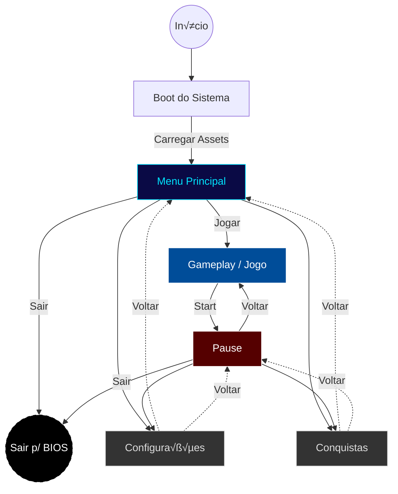
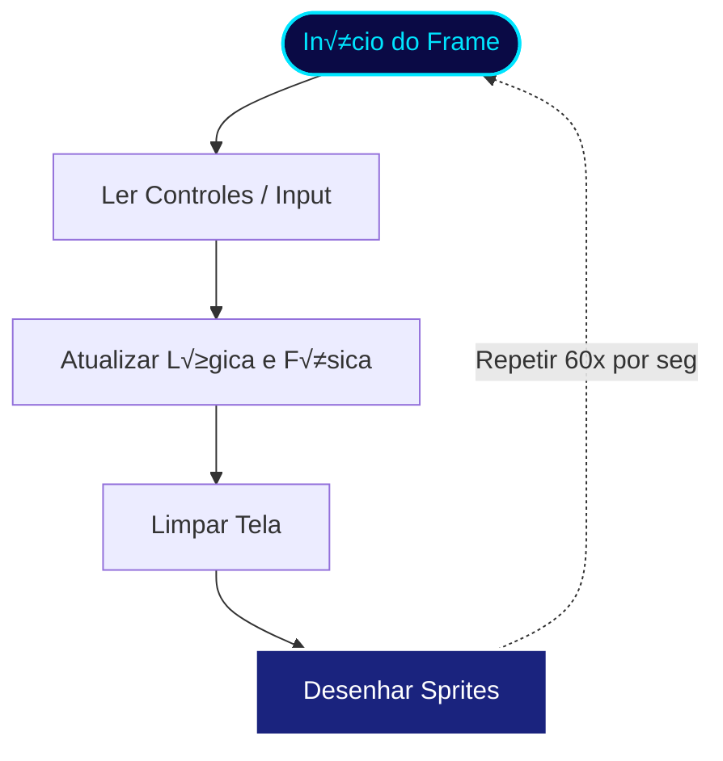
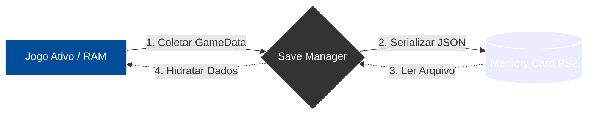

# 🧠 Arquitetura e Fluxo de Dados

Este documento descreve como os dados fluem dentro do jogo **Krone: Ruínas Ancestrais**, desde a inicialização até o loop de jogo.

## 1. Estrutura de Pastas
A organização do código segue o padrão de separação por responsabilidade:

* **`/states`**: M√°quina de estados (Menu, Jogo, Pause).
* **`/systems`**: Gerenciadores globais (Input, Save, Config).
* **`/entities`**: Objetos do jogo (Player, Inimigos).
* **`/data`**: Dados est√°ticos (Conquistas, Paletas de cores).

---

## 2. Diagrama de Estados (FSM)
Este diagrama mostra como o jogo navega entre as diferentes telas (`states`):

```mermaid
graph TD
    %% Nós Principais
    Start((Início)) --> Boot[Boot do Sistema]
    Boot -->|Carregar Assets| Menu[Menu Principal]
    
    %% --- FLUXO DO MENU ---
    Menu -->|Jogar| Jogo[Gameplay / Jogo]
    Menu -->|Sair| BIOS((Sair p/ BIOS))
    
    %% Acesso a Telas Auxiliares (Pelo Menu)
    Menu --> Config[Configurações]
    Menu --> Trophies[Conquistas]

    %% --- FLUXO DO PAUSE ---
    Jogo -->|Start| Pause[Pause]
    Pause -->|Voltar| Jogo
    Pause -->|Sair| BIOS
    
    %% Acesso a Telas Auxiliares (Pelo Pause)
    Pause --> Config
    Pause --> Trophies
    
    %% Voltar (Implícito para não poluir, ou use linhas pontilhadas)
    Config -.->|Voltar| Menu & Pause
    Trophies -.->|Voltar| Menu & Pause

    %% --- ESTILIZAÇÃO ---
    %% Fluxo Principal (Azul/PS2)
    style Menu fill:#0a0a45,color:#00e5ff,stroke:#00e5ff
    style Jogo fill:#004d99,color:#fff,stroke:#fff
    style Pause fill:#550000,color:#fff,stroke:#fff
    
    %% Terminal (Preto)
    style BIOS fill:#000,color:#fff,stroke:#fff,stroke-dasharray: 5 5
    
    %% Telas Auxiliares (Cinza - Secund√°rias)
    style Config fill:#333,color:#ddd,stroke:#ddd
    style Trophies fill:#333,color:#ddd,stroke:#ddd
```

---

## 3. Diagrama de Sequência (Game Loop)
Este diagrama detalha o que acontece no `main.js` a cada frame (60 vezes por segundo):

```mermaid
graph TD
    %% Nós do diagrama
    Start([Início do Frame])
    Input[Ler Controles / Input]
    Logic[Atualizar Lógica e Física]
    Clear[Limpar Tela]
    Draw[Desenhar Sprites]

    %% Conexões
    Start --> Input
    Input --> Logic
    Logic --> Clear
    Clear --> Draw
    
    %% O Loop
    Draw -.->|Repetir 60x por seg| Start

    %% --- SUBSTITA APENAS ESSAS DUAS LINHAS ---
    style Start fill:#0a0a45,color:#00e5ff,stroke:#00e5ff,stroke-width:2px
    style Draw fill:#1a237e,color:#ffffff,stroke:#ffffff,stroke-width:2px
```
---

## 4. Fluxo de Persistência (Save System)
Este diagrama ilustra como os dados do jogador saem da memória RAM e são gravados fisicamente no Memory Card (mc0:) do PlayStation 2.

```mermaid
graph LR
    %% Nós (Elementos do Sistema)
    RAM[Jogo Ativo / RAM]
    Manager{Save Manager}
    MC[(Memory Card PS2)]

    %% Fluxo de SALVAR (Linha Sólida)
    RAM -->|1. Coletar GameData| Manager
    Manager -->|2. Serializar JSON| MC

    %% Fluxo de CARREGAR (Linha Pontilhada)
    MC -.->|3. Ler Arquivo| Manager
    Manager -.->|4. Hidratar Dados| RAM

    %% Estilização
    style RAM fill:#004d99,color:#fff,stroke:#fff
    style Manager fill:#333,color:#fff,stroke:#fff
    style MC fill:#black,color:#fff,stroke:#fff,shape:cylinder
```
