# 🧠 Arquitetura e Fluxo de Dados

Este documento descreve como os dados fluem dentro do jogo **Krone: Ruínas Ancestrais**, desde a inicialização até o loop de jogo.

## 1. Estrutura de Pastas
A organização do código segue o padrão de separação por responsabilidade:

* **`/states`**: Máquina de estados (Menu, Jogo, Pause).
* **`/systems`**: Gerenciadores globais (Input, Save, Config).
* **`/entities`**: Objetos do jogo (Player, Inimigos).
* **`/data`**: Dados estáticos (Conquistas, Paletas de cores).

---

## 2. Diagrama de Estados (FSM)
Este diagrama mostra como o jogo navega entre as diferentes telas (`states`):

graph TD
    %% Nós (Caixas)
    Start((Início)) --> Boot[Boot do Sistema]
    Boot -->|Carregar Assets| Menu[Menu Principal]
    
    %% Conexões Organizadas
    Menu -->|Novo Jogo ou Load| Jogo[Gameplay / Jogo]
    
    Jogo -->|Start| Pause[Pause]
    Pause -->|Voltar| Jogo
    Pause -->|Sair| Menu
    
    Jogo -->|Derrota| GameOver((Game Over))

    %% Estilização
    style Menu fill:#0a0a45,color:#00e5ff,stroke:#00e5ff
    style Jogo fill:#004d99,color:#fff,stroke:#fff
    style Pause fill:#550000,color:#fff,stroke:#fff

---

## 3. Diagrama de Sequência (Game Loop)
Este diagrama detalha o que acontece no `main.js` a cada frame (60 vezes por segundo):

```mermaid
graph TD
    %% Nós do diagrama
    Start([Início do Frame])
    Input[Ler Controles / Input]
    Logic[Atualizar Lógica e Física]
    Clear[Limpar Tela]
    Draw[Desenhar Sprites]

    %% Conexões
    Start --> Input
    Input --> Logic
    Logic --> Clear
    Clear --> Draw
    
    %% O Loop
    Draw -.->|Repetir 60x por seg| Start

    %% --- SUBSTITA APENAS ESSAS DUAS LINHAS ---
    style Start fill:#0a0a45,color:#00e5ff,stroke:#00e5ff,stroke-width:2px
    style Draw fill:#1a237e,color:#ffffff,stroke:#ffffff,stroke-width:2px
```

